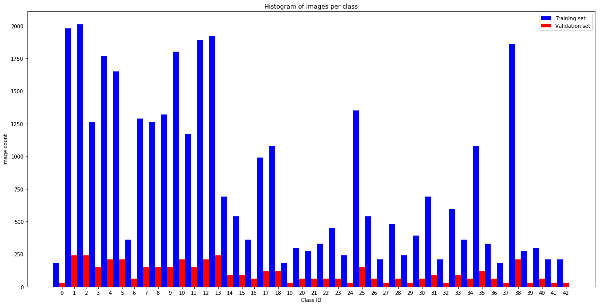
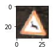
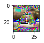
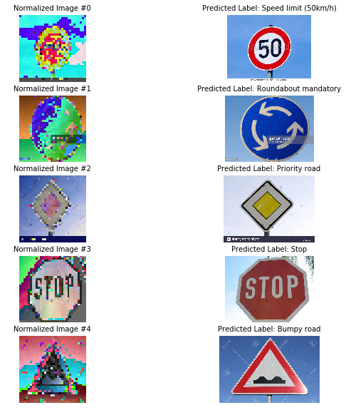

#**Traffic Sign Recognition** 

---

**Build a Traffic Sign Recognition Project**

The goals / steps of this project are the following:

* Load the data set (see below for links to the project data set)
* Explore, summarize and visualize the data set
* Design, train and test a model architecture
* Use the model to make predictions on new images
* Analyze the softmax probabilities of the new images
* Summarize the results with a written report

[//]: # (Image References)

[image1]: ./examples/visualization.jpg "Visualization"
[image2]: ./examples/grayscale.jpg "Grayscaling"
[image3]: ./examples/random_noise.jpg "Random Noise"
[image4]: ./examples/placeholder.png "Traffic Sign 1"
[image5]: ./examples/placeholder.png "Traffic Sign 2"
[image6]: ./examples/placeholder.png "Traffic Sign 3"
[image7]: ./examples/placeholder.png "Traffic Sign 4"
[image8]: ./examples/placeholder.png "Traffic Sign 5"
[image9]: ./examples/histogram.png

---

###Data Set Summary & Exploration

####1. Provide a basic summary of the data set. In the code, the analysis should be done using python, numpy and/or pandas methods rather than hardcoding results manually.

I used the numpy library to calculate summary statistics of the traffic
signs data set:

* The size of training set is  34799
* The size of the validation set is  4410
* The size of test set is 12630
* The shape of a traffic sign image is 32x32
* The number of unique classes/labels in the data set is 43

####2. Include an exploratory visualization of the dataset.

Here is an exploratory visualization of the data set. It is histogram showing the distribution of the training/validation samples. Note that the classes are not evenly distributed. 

###Design and Test a Model Architecture

####1. Describe how you preprocessed the image data. What techniques were chosen and why did you choose these techniques? Consider including images showing the output of each preprocessing technique. Pre-processing refers to techniques such as converting to grayscale, normalization, etc. (OPTIONAL: As described in the "Stand Out Suggestions" part of the rubric, if you generated additional data for training, describe why you decided to generate additional data, how you generated the data, and provide example images of the additional data. Then describe the characteristics of the augmented training set like number of images in the set, number of images for each class, etc.)

To preprocess the date, I normalized the input images in order for the data to have zero mean and equal variance across the training/testing/validation images. Normalizing the data helps improve the numerical stability and the CNN network could converge faster.

Here is an example of a traffic sign image before and after normalizing.

####2. Describe what your final model architecture looks like including model type, layers, layer sizes, connectivity, etc.) Consider including a diagram and/or table describing the final model.

My final model consisted of the following layers:

| Layer         		|     Description	        						| 
|:---------------------:|:---------------------------------------------:| 
| Input         			| 32x32x3 RGB image   						| 
| Convolution 5x5     	| 1x1 stride, valid padding, output 28x28x6	 	|
| Activation			| RELU, output 14x14x6						|
| Max pooling	      		| 2x2 stride,  output 14x14x6 				|
| Convolution 5x5		| 1x1 stride, valid padding, output 10x10x16  	|
| Activation			| RELU, output 10x10x16       					|
| Max pooling			| 2x2 stride, output 5x5x16			     		|
| Flatten 				| output 400								|
| Fully connected		| output 120								|
| Activation			| RELU, output 120				 			|
| Dropout				| Keep probability = 0.8, output 120			|
| Fully connected		| output 84								|
| Activation			| RELU, output 84							|
| Fully connected		| output 43 classes, predictions				|

####3. Describe how you trained your model. The discussion can include the type of optimizer, the batch size, number of epochs and any hyperparameters such as learning rate.

To train the model, I used an Adam optimizer. The parameters used are:

* Learning rate = 0.0005
* BATCH_SIZE  = 200
* EPOCHS = 50

####4. Describe the approach taken for finding a solution and getting the validation set accuracy to be at least 0.93. Include in the discussion the results on the training, validation and test sets and where in the code these were calculated. Your approach may have been an iterative process, in which case, outline the steps you took to get to the final solution and why you chose those steps. Perhaps your solution involved an already well known implementation or architecture. In this case, discuss why you think the architecture is suitable for the current problem.

My final model results were:

* validation set accuracy of 94.8%
* test set accuracy of 93.3%

* I started off with the LeNet architecture. With lower enough learning rate and higher enough epochs number, the maximum validation accuracy remained around 92%. The training accuracy was very high, at a value around 99.9%. This indicated the architecture overfitted the data.

* To solve the problem, an additional dropout layer was inserted with a keep probability of 0.8. Adding this layer improved the validation accuracy to 94.8%.

###Test a Model on New Images

####1. Choose five German traffic signs found on the web and provide them in the report. For each image, discuss what quality or qualities might be difficult to classify.

Here are five German traffic signs that I found on the web:

The left column shows the preprocessed images, and right column shows the original images. The predicted labels are also shown in the second column.

####2. Discuss the model's predictions on these new traffic signs and compare the results to predicting on the test set. At a minimum, discuss what the predictions were, the accuracy on these new predictions, and compare the accuracy to the accuracy on the test set (OPTIONAL: Discuss the results in more detail as described in the "Stand Out Suggestions" part of the rubric).

Here are the results of the prediction:

| Image			        |     Prediction	        					| 
|:---------------------:|:---------------------------------------------:| 
| Speed Limit (50 km/h)     		| Speed Limit (50 km/h) 									| 
| Roundabout mandatory  			| Roundabout mandatory 										|
| Priority Road					| Priority Road											|
| Stop      		| Stop				 				|
| Bumpy Road			| Bumpy Road      							|

The model was able to correctly guess 5 of the 5 traffic signs, which gives an accuracy of 100%. This compares favorably to the accuracy on the test set of 93.3%

####3. Describe how certain the model is when predicting on each of the five new images by looking at the softmax probabilities for each prediction. Provide the top 5 softmax probabilities for each image along with the sign type of each probability. (OPTIONAL: as described in the "Stand Out Suggestions" part of the rubric, visualizations can also be provided such as bar charts)

The code for making predictions on my final model is located in the 39th cell of the Ipython notebook.

For the first image, the model is very sure about the prediction, and the prediction is indeed correct.

| Probability         	|     Prediction	        					| 
|:---------------------:|:---------------------------------------------:| 
|  1.0  |Speed limit (50km/h)  |
| 1.18405e-09   |Speed limit (80km/h)  |
|   5.49132e-12 |Speed limit (30km/h)  |
| 4.63132e-13    |Children crossing  |
|  6.54821e-14  |Speed limit (120km/h)  |

The same can be said for the rest of the images:

* Image 2 Top 5 probabilities:
Roundabout mandatory probability = 0.999997
Go straight or right probability = 1.66767e-06
End of no passing by vehicles over 3.5 metric tons probability = 1.21363e-06
End of no passing probability = 2.5054e-07
Vehicles over 3.5 metric tons prohibited probability = 2.28126e-09

* Image 3 Top 5 probabilities:
Priority road probability = 1.0
Right-of-way at the next intersection probability = 3.20459e-11
Traffic signals probability = 2.51693e-15
No passing for vehicles over 3.5 metric tons probability = 5.70694e-16
Double curve probability = 9.23064e-18

* Image 4 Top 5 probabilities:
Stop probability = 0.999501
Speed limit (30km/h) probability = 0.000264854
Speed limit (50km/h) probability = 0.000176606
Road work probability = 3.57683e-05
Speed limit (60km/h) probability = 1.55938e-05

* Image 5 Top 5 probabilities:
Bumpy road probability = 1.0
Bicycles crossing probability = 2.40196e-10
Beware of ice/snow probability = 1.80695e-14
Children crossing probability = 4.54747e-16
Road work probability = 2.12586e-16

So the model works really well on the five images listed above.

